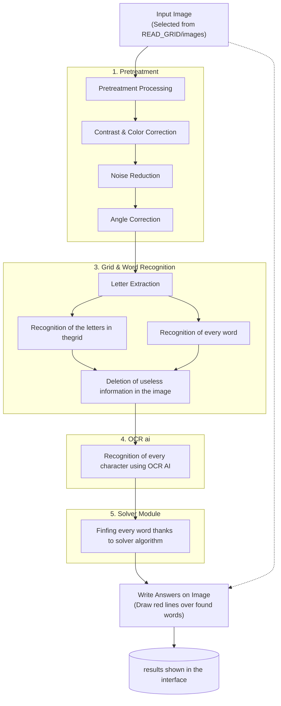

How to use our OCR ?
First, type "make all" in your terminal. Then, execute the ocr file using ./all without any arguments.
The first menu appears and with it, two buttons. 
For training you AI, click on the training button. A new window appears and you will be able to see the training of your AI. To stop the training, click on the stop button. The training will automatically be saved. You then will be back on the first menu window.
Now, if you want to resolve a grid, the picture you want must be in the images folder located in the READ_GRID folder. 
If you do not have any pictures, nothing will appear. Between one and ten, they will all be displayed. However, if you have more than ten pictures, only the ten firsts will be displayed.
Now, choose the image you want, click on it and within seconds, the results will be displayed ! All the words found will be marked by a colored line in the grid. The results are also saved in your files with the name "results.png" and you'll also find the grid of your image written in a txt file under the name "grid_solver.txt".

